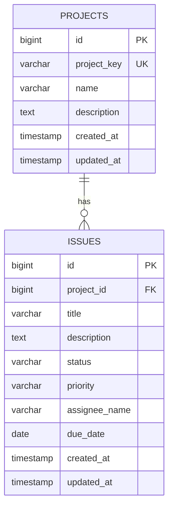

# 1. プロジェクト概要

- **プロジェクト名**: ProjectFlow
- **作成日**: 2026年7月5日
- **更新者**: Codex / 開発支援
- **目的・背景**: ProjectFlow は、Backlog や Jira のようなプロジェクト管理ツールを参考にした学習用Webアプリケーションである。複数プロジェクトと課題の状態を一元管理し、プロジェクト単位の進捗確認、課題の登録・更新・削除・検索をブラウザから行えるようにする。
- **ゴール**: MVPとして、プロジェクト管理、課題管理、ダッシュボードが実DBと連携して動作し、ローカル環境で `frontend` から `backend` のREST APIを呼び出して基本操作を完了できる状態にする。

# 2. 対象ユーザー・関係者

- **ターゲットユーザー**: 小規模な開発チーム、学習者、プロジェクト管理ツールの基本構造を学ぶ開発者。
- **管理者**: MVPでは管理者専用機能は設けない。ローカル開発者がDB、アプリケーション設定、初期データを管理する。
- **外部連携先**: MVPでは外部サービス連携は行わない。将来的には通知、CSV出力、認証基盤などの連携を検討する。

# 3. 業務要件

- **現状の課題（As-Is）**: 学習用プロジェクトでは、プロジェクト情報と課題情報がドキュメントやモック画面に分散し、実DBを使った登録・更新・削除・検索の流れを確認しづらい。ダッシュボードも固定値では、実際の課題状態を把握できない。
- **目指す姿（To-Be）**: プロジェクトと課題をDBに永続化し、画面からCRUD操作と絞り込みを実行できる。ダッシュボードでは件数サマリーと最近更新された課題を確認できる。
- **スコープ（開発範囲）**: 今回はプロジェクト管理、課題管理、ダッシュボード、REST API、PostgreSQL向けDB定義、Vue画面を対象とする。認証、認可、ユーザー管理、コメント、添付ファイル、タグ、通知、Wiki、履歴、CSV出力、ガントチャート、カンバンボードは対象外とする。

# 4. 機能要件

システムが提供する具体的な機能の一覧です。

| No. | 機能名 | 概要 | 詳細・入出力仕様 | 優先度 |
|---|---|---|---|---|
| 1 | ヘルスチェック | バックエンドの稼働状態を確認する | 入力なし。`{"status":"UP"}` を返す。 | Must |
| 2 | ダッシュボード表示 | 全体状況を集計表示する | プロジェクト数、課題数、ステータス別件数、最近更新された課題を表示する。 | Must |
| 3 | プロジェクト一覧 | 登録済みプロジェクトを一覧表示する | ID、プロジェクトキー、名称、説明、更新日時を表示する。 | Must |
| 4 | プロジェクト登録 | 新規プロジェクトを登録する | プロジェクトキー、名称、説明を入力する。プロジェクトキーは重複不可。 | Must |
| 5 | プロジェクト編集 | 既存プロジェクトを更新する | 指定IDのプロジェクト情報を更新する。自分以外のプロジェクトキーとの重複は不可。 | Must |
| 6 | プロジェクト削除 | 既存プロジェクトを削除する | 課題が存在するプロジェクトは削除不可とし、400エラーを返す。 | Must |
| 7 | 課題一覧 | 登録済み課題を一覧表示する | ID、プロジェクトキー、件名、ステータス、優先度、担当者、期限日、更新日時を表示する。 | Must |
| 8 | 課題絞り込み | 課題一覧を条件で絞り込む | `projectId` と `status` を条件に課題一覧を取得する。 | Must |
| 9 | 課題登録 | 新規課題を登録する | プロジェクト、件名、説明、ステータス、優先度、担当者名、期限日を入力する。存在しないプロジェクトIDは404エラー。 | Must |
| 10 | 課題編集 | 既存課題を更新する | 指定IDの課題情報を更新する。ステータスと優先度は定義済みEnumを使用する。 | Must |
| 11 | 課題削除 | 既存課題を削除する | 指定IDの課題を削除する。存在しないIDは404エラー。 | Must |
| 12 | 課題詳細 | 課題の詳細情報を表示する | プロジェクト名、プロジェクトキー、件名、説明、ステータス、優先度、担当者名、期限日、作成日時、更新日時を表示する。 | Must |
| 13 | 共通エラーハンドリング | APIエラーを統一形式で返す | `message` と `details` を持つJSONを返す。バリデーションエラーは項目別エラーを `details` に含める。 | Must |

# 5. 非機能要件

- **可用性**: ローカル開発環境で起動できることを前提とする。商用運用の冗長化、SLA、障害復旧設計はMVP対象外。
- **性能・拡張性**: 初期データ数件から小規模利用を想定する。検索頻度が高い `projects.project_key`, `issues.project_id`, `issues.status`, `issues.updated_at` にインデックスを設定する。
- **運用・保守**: DB定義は `backend/src/main/resources/sql/schema.sql`、初期データは `backend/src/main/resources/sql/data.sql` で管理する。Flyway / Liquibase はMVPでは導入しない。
- **セキュリティ**: MVPでは認証・認可を実装しない。CORSはローカル開発用に `http://localhost:5173` を許可する。個人情報、顧客情報、社内機密情報は扱わない。
- **移行**: 既存システムからのデータ移行は行わない。初期データはSQLで投入する。

# 6. 画面・帳票・API要件

- **画面一覧**:

| 画面ID | 画面名 | 概要 |
|---|---|---|
| SCR-001 | ダッシュボード | バックエンド接続状態、件数サマリー、最近更新された課題を表示する。 |
| SCR-002 | プロジェクト一覧 | プロジェクト一覧、編集、削除、新規作成導線を表示する。 |
| SCR-003 | プロジェクト登録 | プロジェクトキー、名称、説明を登録する。 |
| SCR-004 | プロジェクト編集 | 既存プロジェクトを編集する。 |
| SCR-005 | 課題一覧 | 課題一覧、絞り込み、詳細、編集、削除、新規作成導線を表示する。 |
| SCR-006 | 課題登録 | 課題を登録する。 |
| SCR-007 | 課題詳細 | 課題の詳細項目を表示する。 |
| SCR-008 | 課題編集 | 既存課題を編集する。 |

- **帳票一覧**: MVPでは帳票出力機能は提供しない。

- **API一覧**:

| エンドポイント | メソッド | 概要 |
|---|---|---|
| `/api/health` | GET | ヘルスチェック |
| `/api/dashboard` | GET | ダッシュボード集計取得 |
| `/api/projects` | GET | プロジェクト一覧取得 |
| `/api/projects/{id}` | GET | プロジェクト詳細取得 |
| `/api/projects` | POST | プロジェクト登録 |
| `/api/projects/{id}` | PUT | プロジェクト更新 |
| `/api/projects/{id}` | DELETE | プロジェクト削除 |
| `/api/issues` | GET | 課題一覧取得。`projectId`, `status` で絞り込み可能。 |
| `/api/issues/{id}` | GET | 課題詳細取得 |
| `/api/issues` | POST | 課題登録 |
| `/api/issues/{id}` | PUT | 課題更新 |
| `/api/issues/{id}` | DELETE | 課題削除 |

# 7. データ要件（エンティティ）

- **主要なデータモデル**:

ステータスは `TODO`, `IN_PROGRESS`, `REVIEW`, `DONE` を使用する。優先度は `LOW`, `MEDIUM`, `HIGH` を使用する。

# 8. スケジュール・体制

- **開発スケジュール**:

| フェーズ | 内容 | 状態 |
|---|---|---|
| 企画 | 学習用プロジェクト管理アプリの目的と範囲を整理 | 完了 |
| 要件定義 | MVP対象機能、対象外機能、API、DBを整理 | 完了 |
| 開発 | backend / frontend / SQL / docs を実装 | 完了 |
| テスト | `mvn test` と `npm.cmd run build` による確認 | 完了 |
| リリース | ローカル環境で動作確認後、MVPとして利用開始 | 準備中 |

- **プロジェクト体制**:

| 役割 | 担当 |
|---|---|
| プロダクトオーナー | 学習者 / 利用者 |
| 開発者 | 学習者 / Codex |
| レビュー担当 | 学習者 |
| 運用担当 | ローカル開発者 |

# 9. 制約条件・前提条件

- **前提条件**: Java 21、Maven、Node.js、npm、PostgreSQL 16系がローカル環境で利用できること。frontend は `http://localhost:5173`、backend は `http://localhost:8080` で動作することを想定する。
- **制約条件**: Spring Data JPA は使用せず、DBアクセスはMyBatisで実装する。SQLはMapper XMLに記述する。認証・認可は今回実装しない。ER図ファイルと環境構築手順書は今回の更新対象外とする。
- **リスクと対策**:

| リスク | 影響 | 対策 |
|---|---|---|
| PostgreSQLが起動していない | backend起動時にDB接続エラーになる | 環境構築手順書に従ってDBを起動し、接続情報を確認する。 |
| Maven依存解決で証明書エラーが発生する | `spring-boot:run` が失敗する | Java/Mavenの証明書設定、プロキシ、依存キャッシュを確認する。 |
| 認証がない | 第三者利用には適さない | MVP後にログイン、ユーザー管理、権限管理を追加する。 |
| 課題数増加により一覧が重くなる | 表示速度が低下する | ページング、検索条件、追加インデックスを後続で検討する。 |

# 10. 変更履歴

| 日付 | バージョン | 更新内容 | 更新者 |
|---|---|---|---|
| 2026.07.05 | v0.1 | MVP実装内容に基づき要件定義書を新規作成 | Codex / 開発支援 |
